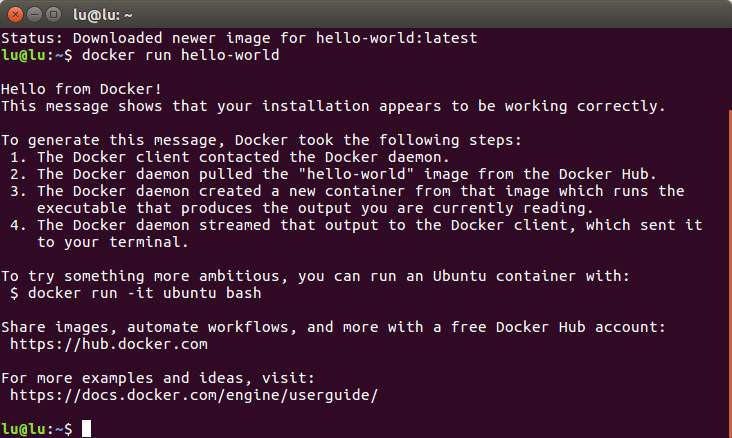

# caffe + ubuntu 16.04


# just try this easy way
```
wget -qO- https://get.docker.com/ | sh  
wget -qO- https://get.docker.com/gpg | sudo apt-key add -  

```
then done

* create docker group
```
sudo usermod -aG docker your_username(lu)
# 退出，然后重新登录，以便让权限生效。
```
为什么需要创建docker用户组？

Docker守候进程绑定的是一个unix socket，而不是TCP端口。这个套接字默认的属主是root，其他是用户可以使用sudo命令来访问这个套接字文件。因为这个原因，docker服务进程都是以root帐号的身份运行的。

为了避免每次运行docker命令的时候都需要输入sudo，可以创建一个docker用户组，并把相应的用户添加到这个分组里面。当docker进程启动的时候，会设置该套接字可以被docker这个分组的用户读写。这样只要是在docker这个组里面的用户就可以直接执行docker命令了。


# hello world
```
docker pull hello-world
docker run hello-world
```


# failed !!!!
seems like the question is GPG key

[officail guide](https://docs.docker.com/engine/installation/linux/ubuntulinux/)

* Update package information, ensure that APT works with the https method, and that CA certificates are installed.
```
$ sudo apt-get update
$ sudo apt-get install apt-transport-https ca-certificates
```


* Add the new GPG key.
```
$ sudo apt-key adv --keyserver hkp://p80.pool.sks-keyservers.net:80 --recv-keys 58118E89F3A912897C070ADBF76221572C52609D
# or try this

sudo apt-key adv --keyserver hkp://keyserver.ubuntu.com:80 --recv-keys 36A1D7869245C8950F966E92D8576A8BA88D21E9
```

* 新增或编辑source列表里的docker.list文件
```
vi /etc/apt/sources.list.d/docker.list  #如果不存在就新增,存在就删除

# or
sudo bash -c "echo deb https://get.docker.io/ubuntu docker main > /etc/apt/sources.list.d/docker.list"
# deb https://apt.dockerproject.org/repo ubuntu-xenial main
```

* Update the APT package index.
```
sudo apt-get update
```
