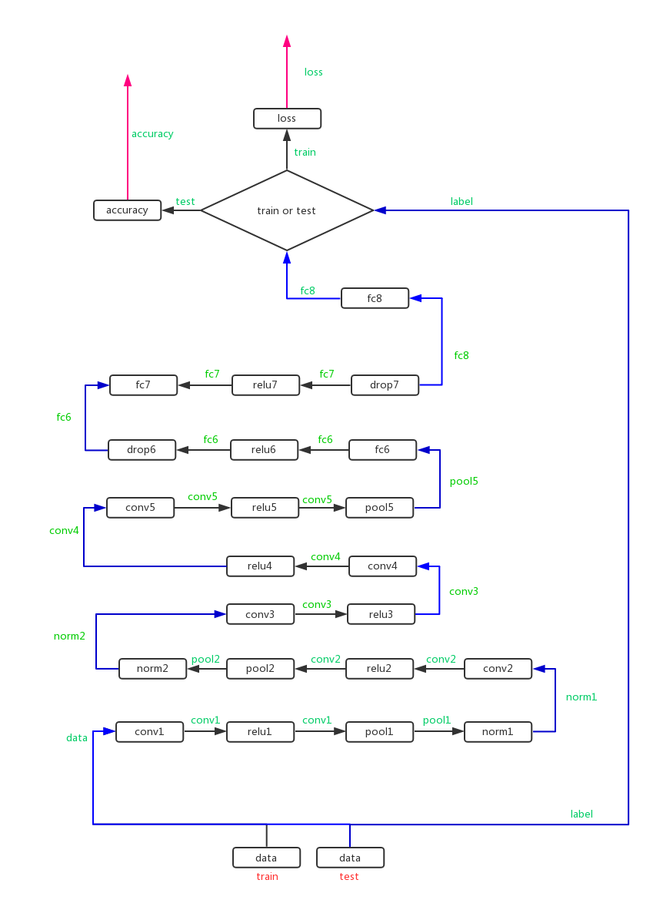

learn caffenet train_val.prototxt

# first is the name of the net
```
name: "CaffeNet"
# name 
```

# input data layer

数据来自于数据库（如LevelDB和LMDB）

```
layer {
  name: "data"
  # input layer's name is data
  type: "Data"
  # input layer's type is Data
  top: "data"
  # connect to the data and label blob空间
  top: "label"

  include {
    phase: TRAIN # 表明这是在训练阶段才包括进去
  }

  # 对数据进行预处理
  transform_param {
    mirror: true
    crop_size: 227
    # 减去均值文件
    mean_file: "data/dcase1/imagenet_mean.binaryproto"
  }
# mean pixel / channel-wise mean instead of mean image
#  transform_param {
#    crop_size: 227
#    mean_value: 104
#    mean_value: 117
#    mean_value: 123
#    mirror: true
#  }
  data_param { # 设定数据的来源
    source: "examples/dcase1/dcase1_train_lmdb"
    batch_size: 256
    backend: LMDB
  }
}
```
 name: 表示该层的名称，可随意取

 

type: 层类型，如果是Data，表示数据来源于LevelDB或LMDB。根据数据的来源不同，数据层的类型也不同（后面会详细阐述）。一般在练习的时候，我们都是采 用的LevelDB或LMDB数据，因此层类型设置为Data。

 

top或bottom: 每一层用bottom来输入数据，用top来输出数据。如果只有top没有bottom，则此层只有输出，没有输入。反之亦然。如果有多个 top或多个bottom，表示有多个blobs数据的输入和输出。

 

data 与 label: 在数据层中，至少有一个命名为data的top。如果有第二个top，一般命名为label。 这种(data,label)配对是分类模型所必需的。

 

include: 一般训练的时候和测试的时候，模型的层是不一样的。该层（layer）是属于训练阶段的层，还是属于测试阶段的层，需要用include来指定。如果没有include参数，则表示该层既在训练模型中，又在测试模型中。

Transformations: 数据的预处理，可以将数据变换到定义的范围内。如设置scale为0.00390625，实际上就是1/255, 即将输入数据由0-255归一化到0-1之间

 

其它的数据预处理也在这个地方设置：

```
transform_param {
    scale: 0.00390625
    mean_file_size: "examples/cifar10/mean.binaryproto"
    # 用一个配置文件来进行均值操作
    mirror: 1  # 1表示开启镜像，0表示关闭，也可用ture和false来表示
    # 剪裁一个 227*227的图块，在训练阶段随机剪裁，在测试阶段从中间裁剪
    crop_size: 227
  }

```
后面的data_param部分，就是根据数据的来源不同，来进行不同的设置。


# part 2 测试集数据
```
layer {
  name: "data"
  type: "Data"
  top: "data"
  top: "label"
  include {
    phase: TEST
  }
  transform_param {
    mirror: false
    crop_size: 227
    mean_file: "data/dcase1/imagenet_mean.binaryproto"
  }
# mean pixel / channel-wise mean instead of mean image
#  transform_param {
#    crop_size: 227
#    mean_value: 104
#    mean_value: 117
#    mean_value: 123
#    mirror: false
#  }
  data_param {
    source: "examples/dcase1/dcase1_val_lmdb"
    batch_size: 50
    backend: LMDB
  }
}
```

# 卷积层　ｅｘａｍｐｌｅ
```
layer {
  name: "conv1"
  type: "Convolution"
  bottom: "data"
  top: "conv1"
  param {
    lr_mult: 1
    decay_mult: 1
  }
  param {
    lr_mult: 2
    decay_mult: 0
  }
  convolution_param {
    num_output: 96
    kernel_size: 11
    stride: 4
    weight_filler {
      type: "gaussian"
      std: 0.01
    }
    bias_filler {
      type: "constant"
      value: 0
    }
  }
}
```
* lr_mult
学习率，但是最终的学习率需要乘以 solver.prototxt 配置文件中的 base_lr .
```
    如果有两个 lr_mult, 则第一个表示 weight 的学习率，第二个表示 bias 的学习率
    一般 bias 的学习率是 weight 学习率的2倍’
```

* decay_mult
权值衰减，为了避免模型的over-fitting，需要对cost function加入规范项。 

* num_output
卷积核（filter）的个数

* kernel_size
卷积核的大小。

`如果卷积核的长和宽不等，需要用 kernel_h 和 kernel_w 分别设定`

* stride
卷积核的步长，默认为1。也可以用stride_h和stride_w来设置。

* pad
扩充边缘，默认为0，不扩充。

```
    扩充的时候是左右、上下对称的，比如卷积核的大小为5*5，那么pad设置为2，则四个边缘都扩充2个像素，即宽度和高度都扩充了4个像素，这样卷积运算之后的特征图就不会变小。
    也可以通过pad_h和pad_w来分别设定。
```

* weight_filler
    权值初始化。 默认为“constant”,值全为0.
    很多时候我们用”xavier”算法来进行初始化，也可以设置为”gaussian”
```
 weight_filler {
    type: "gaussian"
    std: 0.01
}
```
* bias_filler

偏置项的初始化。一般设置为”constant”, 值全为0。

```
bias_filler {
    type: "constant"
    value: 0
}
```

*  bias_term

    是否开启偏置项，默认为true, 开启

* group
    分组，默认为1组。如果大于1，我们限制卷积的连接操作在一个子集内。
    卷积分组可以减少网络的参数，至于是否还有其他的作用就不清楚了。
```
  每个input是需要和每一个kernel都进行连接的，但是由于分组的原因其只是与部分的kernel进行连接的
  如: 我们根据图像的通道来分组，那么第i个输出分组只能与第i个输入分组进行连接。

```


# dropout example
```
layer {
  name: "drop6"
  type: "Dropout"
  bottom: "fc6"
  top: "fc6"
  dropout_param {
    dropout_ratio: 0.5
  }
}
```
* dropout_ratio
丢弃数据的概率


#　relu example
```
layer {
  name: "relu1"
  type: "ReLU"
  bottom: "conv1"
  top: "conv1"
}
```

# pooling
```
layer {
  name: "pool1"
  type: "Pooling"
  bottom: "conv1"
  top: "pool1"
  pooling_param {
    pool: MAX
    kernel_size: 3
    stride: 2
  }
}
```
* pool
池化方法，默认为MAX。目前可用的方法有 MAX, AVE, 或 STOCHASTIC


# norm 
```
layer {
  name: "norm1"
  type: "LRN"
  bottom: "pool1"
  top: "norm1"
  lrn_param {
    local_size: 5
    alpha: 0.0001
    beta: 0.75
  }
}
```

# full connect
```
layer {
  name: "fc6"
  type: "InnerProduct"
  bottom: "pool5"
  top: "fc6"
  param {
    lr_mult: 1
    decay_mult: 1
  }
  param {
    lr_mult: 2
    decay_mult: 0
  }
  inner_product_param {
    num_output: 4096
    weight_filler {
      type: "gaussian"
      std: 0.005
    }
    bias_filler {
      type: "constant"
      value: 1
    }
  }
}
```


# last layer 
output number here is equal to class number
```
layer {
  name: "fc8"
  type: "InnerProduct"
  bottom: "fc7"
  top: "fc8"
  param {
    lr_mult: 1
    decay_mult: 1
  }
  param {
    lr_mult: 2
    decay_mult: 0
  }
  inner_product_param {
    num_output: 1000
    weight_filler {
      type: "gaussian"
      std: 0.01
    }
    bias_filler {
      type: "constant"
      value: 0
    }
  }
}
```

# end 
```
layer {
  name: "accuracy"
  type: "Accuracy"
  bottom: "fc8"
  bottom: "label"
  top: "accuracy"
  include {
    phase: TEST
  }
}
layer {
  name: "loss"
  type: "SoftmaxWithLoss"
  bottom: "fc8"
  bottom: "label"
  top: "loss"
}
```