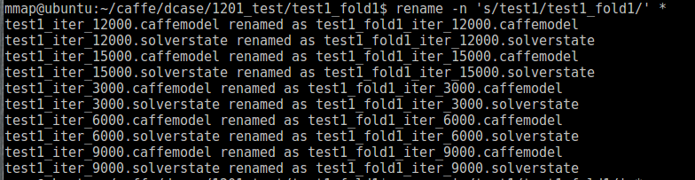
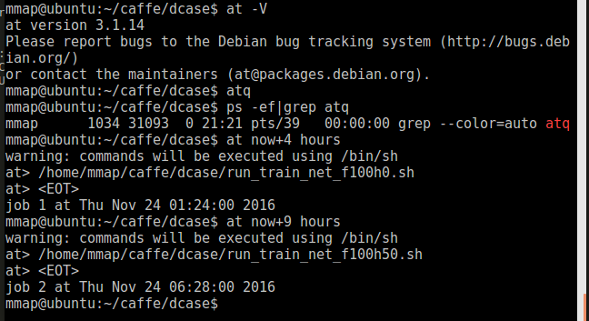

# print home 
```
echo $HOME
```


# rename 
* mv
	```
	linux下重命名文件或文件夹的命令mv既可以重命名，又可以移动文件或文件夹.

	例子：将目录A重命名为B

	mv A B

	例子：将/a目录移动到/b下，并重命名为c

	mv /a /b/c
```

* rename

rename the file with test1 into test1_fold1
	rename 's/test1/test1_fold1/' *




# at


	
	at
	crtl+D save and exit

# tar
* compress
	tar -zcvf cpickle_mixdownf100h0_out6.tar.gz cpickle_mixdownf100h0_out6

* decompress
	tar -zxvf *.tar.gz	